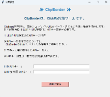

# ClipBorder
 
Clipboardを監視し、悪性のコマンドやURLがペーストされるのを防ぐツールです。
---
 
### 1. インストール手順
 
GitHubの[releases](https://github.com/kinko173/ClipBorder/releases)からzipファイルをダウンロードします。
 
### 2. 起動方法
 
1.  ダウンロードしたZipファイルを解凍します。
2.  展開されたフォルダの中にある**run.bat**をダブルクリックして起動します。
    * デスクトップから起動したい場合は、run.batのショートカットをデスクトップに作成してください。
 
### 3. 初回起動時の設定

初回起動時には、LLMおよびURL検知ツールを利用するための**APIキー**を入力する必要があります。以下の手順に従って、それぞれのAPIキーを取得してください。
 
---
 
### LLM APIキーの取得方法
 
1.  以下のURLにアクセスします：https://console.groq.com/keys
2.  ログイン画面が表示されるので、アカウントでログインします。
3.  ログイン後、右上の「Create API Key」をクリックします。
4.  表示された画面に任意の名前を入力し、**Submit**を押すとAPIキーが表示されます。
5.  表示されたAPIキーをコピーして、初回起動画面の「LLM APIキー入力欄」にペーストしてください。
 
---
 
### URL検知用 APIキーの取得方法
 
1.  以下のURLにアクセスします：https://auth.abuse.ch
2.  ログイン画面が表示されるので、アカウントを作成またはログインします。
3.  ログイン後、「Screen Name」と「Display Name」に任意の文字列（半角英数字記号で3文字以上）を入力し、✓マークが表示されることを確認します。
4.  一番下までスクロールして、左下の「Create Profile」をクリックします。
5.  その後、画面右側の「Generate Key」を押します。
6.  「Got it!」と表示されたら押下し、**Auth Key**欄にAPIキーが表示されます。
7.  そのキーをコピーして、初回起動画面の「URL検知用 APIキー入力欄」にペーストしてください。
 
---
 
### 設定完了
 
初回起動画面で各APIキーを入力後、「保存して開始」ボタンを押すと設定が保存されます。キーが正しければ、次の設定画面が表示され、ClipBorderが利用可能となります。
 
---
 
### 補足
 
* APIキーは他人に知られないように管理してください。
* 不正なAPIキーや入力ミスがある場合、ツールは正常に動作しません。
* 2回目以降の起動時はキー入力は不要です。
* APIキーが無効な場合は、再度上記手順で新しいキーを取得してください。

---

## ClipBorderの使い方
### 設定画面

- 機能のON/OFF 
ClipBorderによるクリップボード監視機能を有効/無効にできます。 
- ホワイトリスト登録 
ホワイトリスト登録では、任意のテキストや URL を登録して、検知対象外に設定できます。
新規追加・削除も可能です。 
- APIキー設定 
API キーが無効になった場合や、新しいキーに変更したい場合に使用します。
新しいキーを入力し、保存すればすぐに反映されます。

### 警告画面
ClipBorder は、コピーされたテキスト内に悪性のコマンドや URL を検出すると、
警告画面を自動的に表示します。
この画面では、以下の情報が確認できます：
- コピーされたテキストの内容
- 検出されたコマンドまたは URL
- LLM による危険と判断した理由の説明

---
## アンインストール方法
1.  Win+Rボタンを押して「regedit」を入力し、Enterを押す。
2.  レジストリエディターの「コンピューター\HKEY_CURRENT_USER\Software\Microsoft\Windows\CurrentVersion\Run」からAntiClickfixMonitorを選択し右クリック
3.  削除を選択
4.  ClipBorderのディレクトリを削除
